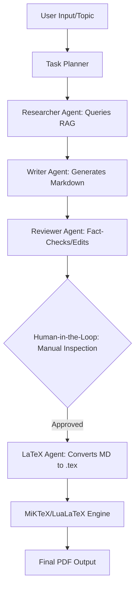

# System Architecture Plan: Autonomous Academic Paper Generation Pipeline

## 1. Architecture Overview (C4 Model Concept)

### Context
The system is an autonomous research and writing pipeline. The user provides a high-level topic (e.g., "Extraterrestrials and Conspiracy Theories") and receives a professionally formatted, 25-30 page academic paper in PDF format.

### Container Diagram
- **CrewAI Orchestrator:** Manages agent roles, task delegation, and sequential/hierarchical workflows.
- **RAG Knowledge Engine:** A vector-database-backed retrieval system that provides factual grounding from local PDF sources.
- **LaTeX Compilation Pipeline:** A specialized container that handles the conversion of Markdown to `.tex` and performs multi-pass compilation using LuaLaTeX.

### Component Diagram (AI Agents)
- **Researcher Agent:** Specialized in querying the RAG engine, extracting citations, and synthesizing factual summaries.
- **Writer Agent:** Focuses on academic prose, structuring chapters, and integrating references in Markdown.
- **Reviewer Agent:** Acts as a quality gate, verifying factual consistency against RAG data and ensuring academic tone.
- **LaTeX Formatter Agent:** Responsible for technical translation of Markdown to LaTeX, including TikZ diagrams, Drake equation formatting, and Python code block management.
- **Skills vs. Tools Architecture:** Agents will be injected with explicit Skills (via dedicated SKILL.md files detailing the "how" of academic writing/reviewing) alongside standard Tools (the "what", such as file reading and RAG queries), maintaining strict separation of concerns.

### SDK Architecture
**Core Principle:** All business logic, agent orchestration, and RAG operations are encapsulated within a centralized **SDK Layer**.
- No direct CLI or UI logic interacts with the LLMs or the RAG database.
- The SDK provides a clean interface for "Research", "Draft", and "Compile" actions.
- This ensures modularity, testability, and prevents "logic leak" into the presentation layers.

---

## 2. Process Flow & UML Diagrams

### Sequential Process Flow

* **Human-in-the-Loop (Positive AI Economy):** Before the LaTeX Agent initiates the final multi-pass compilation, the system pauses to allow human inspection of the Markdown draft and TikZ formulas, ensuring safety and academic accuracy.

### Deployment & Runtime Environment

---

## 3. API Documentation, Interfaces & Data Contracts

### Agent-to-Agent Data Contracts
- **Researcher -> Writer:** Structured JSON containing `fact_clusters`, each with `content`, `source_metadata`, and `citation_key`.
- **Writer -> Reviewer:** A full Markdown draft string with placeholder tags for images, graphs, and complex formulas.
- **Reviewer -> LaTeX Agent:** Validated Markdown including TikZ source code, Python script blocks for graphs, and LaTeX math strings (e.g., Drake Equation).

### API Gatekeeper Contract
The **Gatekeeper** is a mandatory wrapper for all external API calls.
- **Rate Limiting:** Implements token-bucket algorithms to stay within LLM tier limits.
- **Retries:** Exponential backoff for 429 (Rate Limit) and 5xx errors.
- **Queuing:** Serializes high-volume requests to prevent concurrency-based bans.
- **Configuration-Driven Limits:** Zero hard-coded values. All rate limits, timeouts, and maximum retry counts are loaded dynamically from a versioned config/rate_limits.json file

### RAG Embedding Schema
- **Embedding Model:** `text-embedding-3-small` (or equivalent).
- **Chunk Size:** 1000 tokens.
- **Overlap:** 100 tokens.
- **Metadata:** Includes page numbers, file names, and section headers for accurate BibTeX generation.

---

## 4. Architectural Decision Records (ADRs)

### ADR 1: Choosing CrewAI over LangGraph
- **Rationale:** CrewAI provides a role-playing framework that mirrors a human editorial team. Academic writing is a structured, sequential process (Research -> Write -> Review) which CrewAI handles natively with less boilerplate than the state-machine approach of LangGraph.
- **Trade-off:** Less flexibility for highly complex cyclical loops compared to LangGraph.

### ADR 2: Strict RAG vs. Live Web Search
- **Rationale:** To ensure academic integrity and prevent hallucinations, the system relies strictly on provided PDF sources. This ensures that every citation in the bibliography corresponds to a real document in the RAG store.
- **Trade-off:** The system cannot incorporate breaking news or information outside the provided corpus.

### ADR 3: Using LuaLaTeX for Compilation
- **Rationale:** LuaLaTeX is the modern standard for BiDi (Bidirectional) support. It handles the mix of Hebrew text (final output) and English/Mathematical formulas (Drake Equation/TikZ) far better than pdfLaTeX or XeLaTeX.
- **Trade-off:** Slower compilation times compared to older engines.

### ADR 4: Implementing an API Gatekeeper & Sandbox
- **Rationale:** Generating 30 pages requires thousands of LLM calls; the Gatekeeper prevents costly interruptions. The Sandbox (WSL) ensures that AI-generated Python code for graphs cannot access the host file system or network.
- **Trade-off:** Increased architectural complexity and environment setup overhead.

---

## 5. Observability & The Harness Pattern

All agents are wrapped in a **Harness Pattern**:
- **Logging:** Every input prompt and output completion is logged with a unique `session_id`.
- **Context Tracking:** The Harness records exactly which RAG chunks were injected into the prompt.
- **Token Usage:** Real-time tracking of input/output tokens per agent to monitor production costs and efficiency.
- **Health Checks:** Periodic verification of the LaTeX engine and Vector DB connectivity.

---
**Prepared by:** Senior System Architect
**Date:** June 8, 2026
