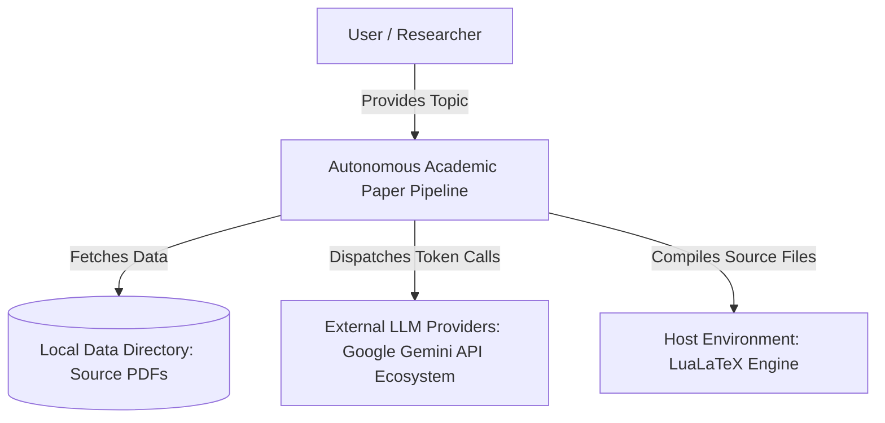
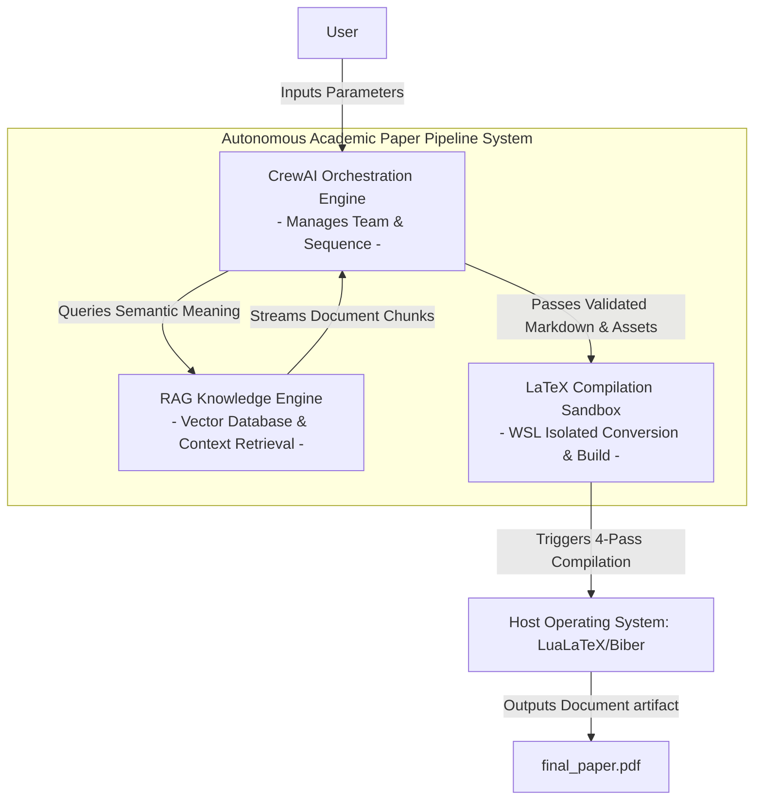
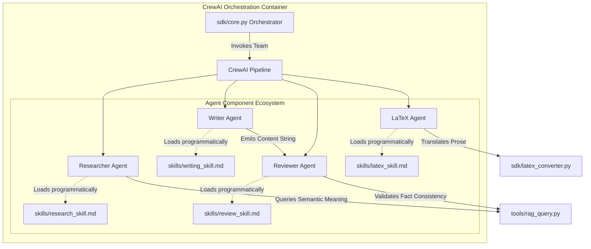
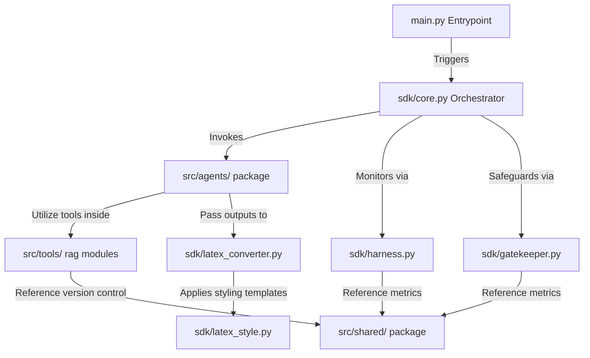
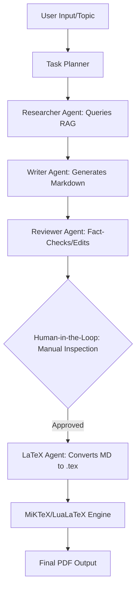
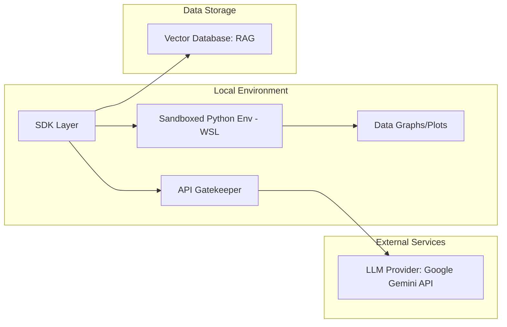

# System Architecture Plan: Autonomous Academic Paper Generation Pipeline

## 1. Architecture Overview (C4 Model Concept)

### Context
The system is an autonomous research and writing pipeline. The user provides a high-level topic (e.g., "Extraterrestrials and Conspiracy Theories") and receives a professionally formatted, 25-30 page academic paper in PDF format.



### Container Diagram
- **CrewAI Orchestrator:** Manages agent roles, task delegation, and sequential/hierarchical workflows.
- **RAG Knowledge Engine:** A vector-database-backed retrieval system that provides factual grounding from local PDF sources.
- **LaTeX Compilation Pipeline:** A specialized container that handles the conversion of Markdown to `.tex` and performs multi-pass compilation using LuaLaTeX.



### Component Diagram (AI Agents)
- **Researcher Agent:** Specialized in querying the RAG engine, extracting citations, and synthesizing factual summaries.
- **Writer Agent:** Focuses on academic prose, structuring chapters, and integrating references in Markdown.
- **Reviewer Agent:** Acts as a quality gate, verifying factual consistency against RAG data and ensuring academic tone.
- **LaTeX Formatter Agent:** Responsible for technical translation of Markdown to LaTeX, including TikZ diagrams, Drake equation formatting, and Python code block management.
- **Skills vs. Tools Architecture:** Agents will be injected with explicit Skills (via dedicated SKILL.md files detailing the "how" of academic writing/reviewing) alongside standard Tools (the "what", such as file reading and RAG queries), maintaining strict separation of concerns.



### SDK Architecture
**Core Principle:** All business logic, agent orchestration, and RAG operations are encapsulated within a centralized **SDK Layer**.
- No direct CLI or UI logic interacts with the LLMs or the RAG database.
- The SDK provides a clean interface for "Research", "Draft", and "Compile" actions.
- This ensures modularity, testability, and prevents "logic leak" into the presentation layers.

### 1.5 Repository Directory Hierarchy (Code Level Architecture)

To enforce strict separation of concerns, data isolation, and structural modularity, the codebase must adhere to the following directory layout:

```text
project-root/
│
├── src/                         # Core source code layer
│   └── autonomous_pipeline/     # Main application package
│       ├── __init__.py
│       ├── main.py              # Application entry point
│       │
│       ├── sdk/                 # SDK Layer (Single entry point for all business logic)
│       │   ├── __init__.py
│       │   ├── core.py          # CrewAI coordinator and execution flow orchestrator
│       │   ├── gatekeeper.py    # Centralized API manager (FIFO queue, 429 rate limiting)
│       │   ├── harness.py       # Observability pattern (Token tracking, log capture)
│       │   ├── latex_converter.py  # Markdown-to-TeX syntax translator
│       │   └── latex_style.py   # Document preamble configurations, headers/footers
│       │
│       ├── agents/              # Specialized AI Agent configurations (Programmatic Skills)
│       │   ├── __init__.py
│       │   ├── researcher.py    # RAG querying agent
│       │   ├── writer.py        # Hebrew content generation agent
│       │   ├── reviewer.py      # Quality control & fact checking gatekeeper
│       │   └── latex_agent.py   # Document styling and component assembler
│       │
│       ├── tools/               # Modular tools and components
│       │   ├── __init__.py
│       │   ├── rag_core.py      # Base vector database connectivity
│       │   ├── rag_parser.py    # PDF document parsing and metadata extraction
│       │   └── rag_query.py     # Cosine similarity query mechanics
│       │
│       └── shared/              # Shared immutable configurations
│           ├── __init__.py
│           ├── constants.py     # System-wide project constants
│           └── version.py       # Global version tracking module (Initialized to 1.00)
│
├── tests/                       # Test-Driven Development (TDD) infrastructure
│   ├── conftest.py              # Shared global fixtures
│   ├── unit/                    # Isolated unit tests
│   └── integration/             # Component pipeline integration tests
│
├── docs/                        # Mandatory architectural documentation files
│   ├── PRD.md                   # Core Product Requirements Document
│   ├── PLAN.md                  # This System Architecture Plan
│   ├── TODO.md                  # Granular task tracker
│   └── PRD_rag_engine.md        # Dedicated RAG specifications document
│
├── config/                      # Externalized configuration ecosystem
│   ├── setup.json               # Application setup parameters
│   └── rate_limits.json         # Versioned rate-limit threshold matrices
│
├── skills/                      # CrewAI programmatic expertise files
│   ├── research_skill.md        # Factual extraction and memory poisoning prevention
│   ├── writing_skill.md         # Academic Hebrew prose and velocity target
│   ├── review_skill.md          # Truth-verification protocol and hallucination elimination
│   └── latex_skill.md           # TikZ syntax and mathematical notation layout
│
├── data/                        # Local data storage for research corpus
│   ├── raw/                     # Original PDF source documents
│   └── processed/               # Generated Markdown and bibliography artifacts
│
├── logs/                        # System-wide logs and Prompt Engineering Log
│   └── prompt_log.md            # Versioned AI system prompts and manual feedback
│
├── assets/                      # Generated visual assets (Images, Graphs, Diagrams)
│
└── notebooks/                   # Research and analysis Jupyter Notebooks
    └── analysis_results.ipynb   # Sensitivity and results analysis
```



---

## 2. Process Flow & UML Diagrams

### Sequential Process Flow

* **Human-in-the-Loop (Positive AI Economy):** Before the LaTeX Agent initiates the final multi-pass compilation, the system pauses to allow human inspection of the Markdown draft and TikZ formulas, ensuring safety and academic accuracy.



### Deployment & Runtime Environment


---

## 3. API Documentation, Interfaces & Data Contracts

### Agent-to-Agent Data Contracts
- **Researcher -> Writer:** Structured JSON containing `fact_clusters`, each with `content`, `source_metadata`, and `citation_key`.
- **Writer -> Reviewer:** A full Markdown draft string with placeholder tags for images, graphs, and complex formulas.
- **Reviewer -> LaTeX Agent:** Validated Markdown including TikZ source code, Python script blocks for graphs, and LaTeX math strings (e.g., Drake Equation).

### API Gatekeeper Contract
The **Gatekeeper** is a mandatory wrapper for all external API calls.
- **Rate Limiting:** Implements token-bucket algorithms to stay within LLM tier limits.
- **Retries:** Exponential backoff for 429 (Rate Limit) and 5xx errors.
- **Queuing:** Serializes high-volume requests to prevent concurrency-based bans.
- **Configuration-Driven Limits:** Zero hard-coded values. All rate limits, timeouts, and maximum retry counts are loaded dynamically from a versioned config/rate_limits.json file.

### RAG Embedding Schema
- **Embedding Model:** `text-embedding-004` (Google Gemini).
- **Chunk Size:** 1000 tokens.
- **Overlap:** 100 tokens.
- **Metadata:** Includes page numbers, file names, and section headers for accurate BibTeX generation.

---

## 4. Architectural Decision Records (ADRs)

### ADR 1: Choosing CrewAI over LangGraph
- **Rationale:** CrewAI provides a role-playing framework that mirrors a human editorial team. Academic writing is a structured, sequential process (Research -> Write -> Review) which CrewAI handles natively with less boilerplate than the state-machine approach of LangGraph.
- **Alternatives Considered:** LangGraph (State-Chart based orchestration). Dismissed because LangGraph introduces significant cyclical boilerplate and state-variable overhead for what is inherently a highly linear, multi-phase editorial review pipeline (Research -> Draft -> Review -> Format).
- **Chosen Option Trade-offs:** By choosing CrewAI, we trade away the ability to easily model highly complex, non-linear cyclic graph states. If a chapter requires an infinite edit loop between the writer and reviewer, CrewAI’s sequential/hierarchical architecture introduces deterministic bounds, forcing us to hardcode maximum iterative review passes.

### ADR 2: Strict RAG vs. Live Web Search
- **Rationale:** To ensure academic integrity and prevent hallucinations, the system relies strictly on provided PDF sources. This ensures that every citation in the bibliography corresponds to a real document in the RAG store.
- **Alternatives Considered:** Google Serper API / Tavily Web Search tools. Dismissed because live web engines present acute hallucination vulnerability, dynamic data mutability, and a complete failure to provide strict, deterministic, verifiable page-and-section level metadata tracking required for exact academic BibTeX references.
- **Chosen Option Trade-offs:** Restricting the knowledge base strictly to local PDFs limits the document's temporal scope. The system is completely blind to real-world context adjustments, immediate scientific updates, or breaking news regarding the topic published outside the provided offline ingestion data.

### ADR 3: Using LuaLaTeX for Compilation
- **Rationale:** LuaLaTeX is the modern standard for BiDi (Bidirectional) support. It handles the mix of Hebrew text (final output) and English/Mathematical formulas (Drake Equation/TikZ) far better than pdfLaTeX or XeLaTeX.
- **Alternatives Considered:** pdfLaTeX or XeLaTeX. Dismissed because pdfLaTeX offers fundamentally inadequate native Bidirectional (BiDi) language processing for rendering complex right-to-left (RTL) Hebrew intertwined with mathematical blocks, and XeLaTeX exhibits structural runtime stability degradation under heavy nested TikZ vector block generation.
- **Chosen Option Trade-offs:** LuaLaTeX runs an internal dynamic Lua interpreter, which significantly increases compute load and rendering times. Compilation cycles (especially the mandatory 4-pass sequence containing dense nested TikZ packages) take substantially longer to output the final artifact compared to classical engines like pdfLaTeX.

### ADR 4: Implementing an API Gatekeeper & Sandbox
- **Rationale:** Generating 30 pages requires thousands of LLM calls; the Gatekeeper prevents costly interruptions. The Sandbox (WSL) ensures that AI-generated Python code for graphs cannot access the host file system or network.
- **Alternatives Considered:** Executing raw, agent-generated Python code directly on the host shell without isolation. Dismissed because it introduces fatal security risks (host resource compromise/network penetration via unvetted code execution) and lacks token bucket backpressure rate-limiting, inviting unhandled 429 concurrency bans.
- **Chosen Option Trade-offs:** Introducing an infrastructure proxy layer and isolated execution container increases architectural complexity and runtime orchestration overhead. The pipeline requires local system prerequisite configurations (WSL initialization, shared path mappings) and introduces slight communication latency via the FIFO queue buffering system.

---

## 5. Observability & The Harness Pattern

All agents are wrapped in a **Harness Pattern**:
- **Logging:** Every input prompt and output completion is logged with a unique `session_id`.
- **Context Tracking:** The Harness records exactly which RAG chunks were injected into the prompt.
- **Token Usage:** Real-time tracking of input/output tokens per agent to monitor production costs and efficiency.
- **Health Checks:** Periodic verification of the LaTeX engine and Vector DB connectivity.

---
**Prepared by:** Senior System Architect
**Date:** June 8, 2026
